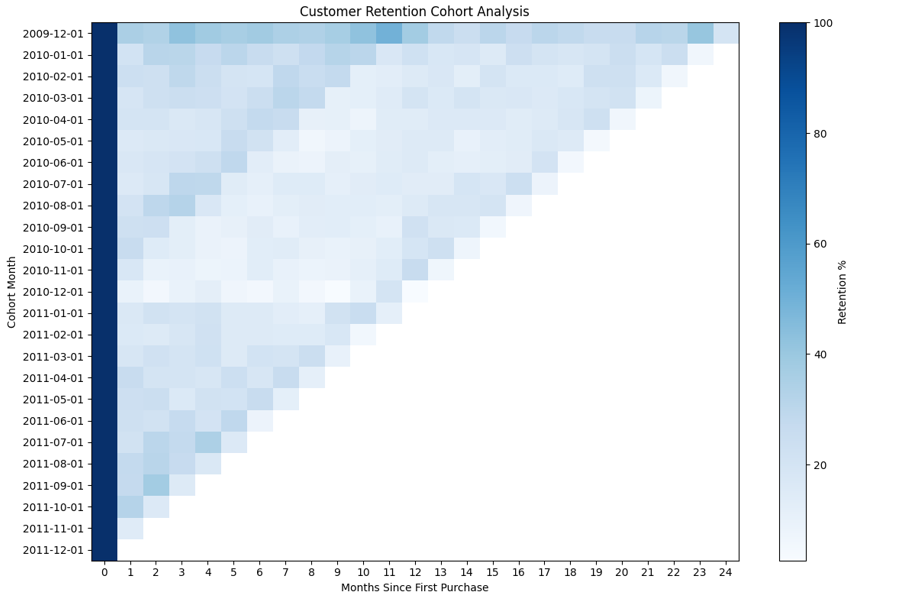
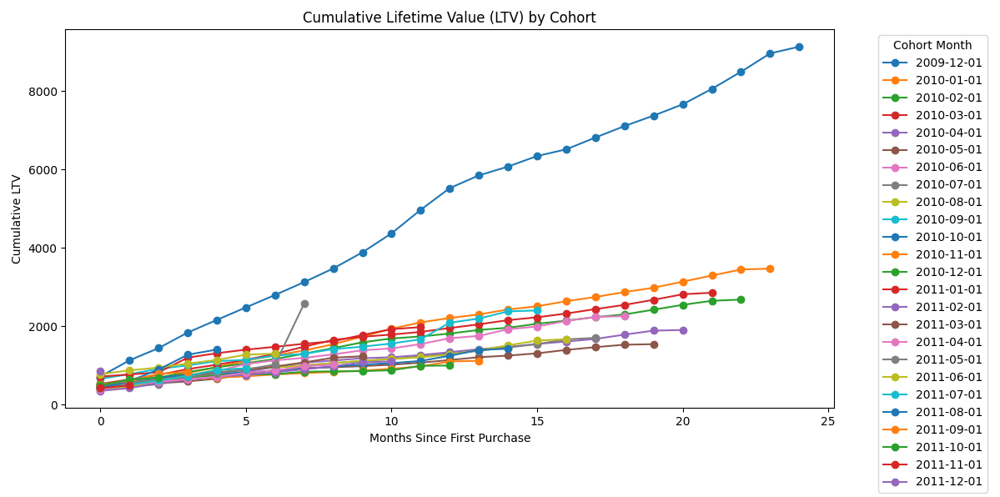

# 📊 Customer Cohort & Retention Analysis | SQL | Python | LTV Modeling

## 🚀 Executive Summary

This end-to-end analytics project performs **Customer Cohort Analysis** to evaluate long-term customer retention and lifetime value (LTV) using **SQL (SQLite)** and **Python**.

The objective is to simulate how a data analyst supports growth and product teams by analyzing post-acquisition behavior, identifying churn patterns, measuring revenue concentration, and generating actionable retention insights.

**Workflow:**  
Raw Transaction Data → Data Cleaning (SQL) → Cohort Assignment → Retention Modeling → ARPU Calculation → Cumulative LTV → Visualization → Business Recommendations

---

## 🧠 Business Questions Answered

- What is the month-over-month retention trend?
- Which acquisition cohorts generate the highest long-term value?
- When does most revenue occur in the customer lifecycle?
- How quickly does cumulative LTV build?
- Which cohorts require retention optimization?

---

## 🛠 Tech Stack

- SQL (SQLite – Window Functions, Aggregations)
- Python 3.x
- pandas (Data Processing)
- numpy (Numerical Computation)
- matplotlib (Data Visualization)
- CSV-based structured outputs

---

## 📂 Repository Structure
```
customer-cohort-retention-analysis/
│
├── data/
│   ├── retention_table.csv
│   ├── cohort_ltv.csv
│
├── images/
│   ├── retention_heatmap.png
│   ├── ltv_growth.png
│
├── sql/
│   ├── cohort_analysis.sql
│
├── cohort_analysis.py
└── README.md
```
---

## 🔍 Analytical Framework

### 1️⃣ Data Cleaning (SQL)

- Removed null customer IDs
- Filtered negative quantities and prices
- Created transaction-level revenue column

### 2️⃣ Cohort Assignment

- Identified each customer’s first purchase month
- Grouped customers into monthly acquisition cohorts

### 3️⃣ Cohort Index Calculation

- Calculated months since first purchase
- Modeled lifecycle progression using SQL date arithmetic

### 4️⃣ Retention Modeling

- Counted active users per cohort per month
- Calculated retention percentage using SQL window functions
- Generated structured retention dataset

### 5️⃣ Revenue & LTV Modeling

- Computed total revenue per cohort per month
- Calculated Average Revenue Per User (ARPU)
- Built cumulative LTV using rolling window calculations

### 6️⃣ Visualization & Insights (Python)

- Retention heatmap visualization
- LTV growth line chart by cohort
- Console-based analytical insights
- Business recommendations based on churn & revenue behavior

---

## 📈 Key Results

- Significant retention drop observed after Month 1
- Early lifecycle months generate highest revenue impact
- Certain cohorts outperform others in cumulative LTV
- Revenue growth stabilizes after initial engagement period

---

## 📊 Visualizations

### 🔵 Retention Heatmap



### 📈 Cumulative LTV by Cohort



---

## 💡 Business Impact

✔ Identified lifecycle churn points  
✔ Quantified revenue concentration timing  
✔ Highlighted high-performing acquisition cohorts  
✔ Provided data-driven retention strategy recommendations  
✔ Simulated real-world growth analytics workflow  

---

## 📌 Skills Demonstrated

- Advanced SQL (Window Functions, Cohort Modeling)
- Retention Analytics
- ARPU & Lifetime Value (LTV) Calculation
- End-to-End Data Pipeline Design
- Data Visualization for Stakeholder Communication
- Business Insight Generation

---

## 🚀 How to Run

### 1️⃣ Execute SQL Script

sql/cohort_analysis.sql

### 2️⃣ Run Python Analysis

python cohort_analysis.py

### 3️⃣ Output

Visualizations will be generated inside:

images/

---

## 📦 Data Availability

The original raw dataset (Online Retail dataset) and generated SQLite database file are not included in this repository due to file size limitations.

This repository contains the processed cohort output tables inside the `data/` folder:

- retention_table.csv  
- cohort_ltv.csv  

These files support visualization and insight generation.

To fully reproduce the end-to-end pipeline (data cleaning, cohort creation, retention modeling, and LTV calculation), the original Online Retail dataset must be obtained separately and the SQL script located in the `sql/` directory should be executed locally.

---

---

## 📎 Full Project Files

Due to GitHub file size limitations, the complete raw dataset and database file are hosted externally.

🔗 Download full project files here:  
https://drive.google.com/drive/folders/1JXbon0Xske7Y9A3uUw5M8xwEGb3nxxZ-?usp=sharing

After downloading, place the files inside the `data/` folder before running the SQL pipeline.

---

## 👤 Author

Y. Rithvesh  
SQL | Python | Data Analytics | Retention Modeling  
Date: 20-02-2026
